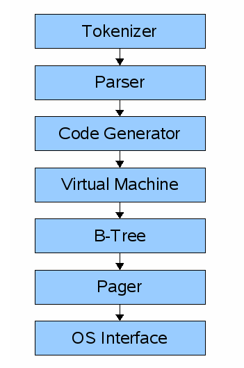

# SQLite 
The structure we will follow to make our SQLite Database is:

### Frontend: 
A query goes through the chain of components to retrieve, modify and insert the data. The frontend has:
1. Tokenizer 
2. Parser 
3. Code Generator
The output of the code generator is bytecode which is passed in virtual machine. 
### Backend
It gets the virtual machine bytecode(this is a compiled program that can operate on the database). Backend consist of:
1. Virtual Machine 
2. B-Tree 
3. Pager 
4. OS Interface
 

We can think Virtual machine as big switch statement on the type of bytecode instruction. 
  
#### We will start with making REPL 